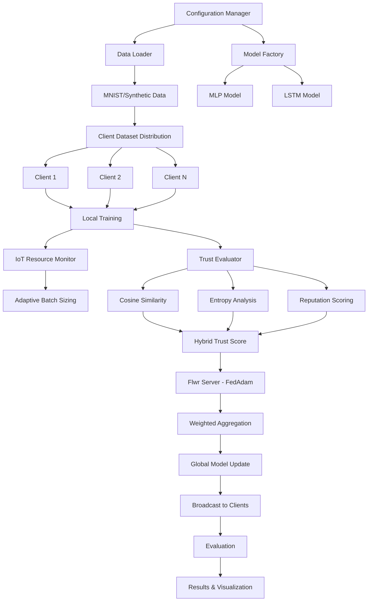

# TRUST MCNet (Multi-Client Network)

A comprehensive federated learning framework for **anomaly detection** with **trust mechanisms** and **IoT device optimization**.

## Project Overview

TRUST MCNet is an advanced distributed machine learning system that enables multiple IoT clients to collaboratively train models for anomaly detection while maintaining data privacy. The framework includes sophisticated trust mechanisms to ensure reliable collaboration between resource-constrained devices and supports both traditional federated learning and modern Flower (Flwr) integration.

## Key Features

- **🔒 Federated Learning**: Distributed training across multiple IoT clients with privacy preservation
- **🛡️ Advanced Trust Mechanisms**: Multi-modal trust evaluation (cosine similarity, entropy, reputation)
- **📱 IoT Optimization**: Resource monitoring, adaptive batch sizing, memory management
- **🤖 Multi-Model Support**: MLP and LSTM architectures for different data types
- **⚠️ Anomaly Detection**: Specialized binary classification for detecting anomalous patterns
- **🌸 Flwr Integration**: Modern federated learning with FedAdam strategy
- **📊 Comprehensive Metrics**: Detailed evaluation, visualization, and experiment tracking
- **🔧 Attack Simulation**: Built-in capabilities for testing robustness (label flipping, Gaussian noise)

## Architecture Overview

### Core Pipeline Components

```
📱 IoT Clients (5-50 devices)
    ↓ Local Training
🧠 Trust Evaluator (Cosine + Entropy + Reputation)
    ↓ Trust Scores
🌸 Flwr Server (FedAdam Strategy)
    ↓ Weighted Aggregation
🔄 Global Model Update
    ↓ Broadcast
📊 Evaluation & Results
```

### Data Pipeline
- **MNIST Dataset**: Converted to binary anomaly detection (digits 1,7 as anomalies)
- **Synthetic IoT Data**: Generated sensor data with configurable anomaly patterns
- **Custom Datasets**: Support for CSV data with preprocessing
- **Data Distribution**: Both IID and non-IID federated splits

### Trust Mechanisms
1. **Cosine Similarity**: Trust based on model update similarity to global model
2. **Entropy-based**: Higher parameter entropy indicates better model diversity
3. **Reputation**: Historical performance tracking and scoring
4. **Hybrid Combination**: Weighted combination (0.4, 0.3, 0.3) of all methods

### IoT Optimizations
- **Resource Monitoring**: Real-time CPU and memory tracking
- **Adaptive Training**: Dynamic batch size and epoch adjustment
- **Memory Management**: Automatic cleanup and single-threaded operations
- **Connection Handling**: Timeout management and retry mechanisms

## System Architecture



## Project Structure

```
TRUST_MCNet/
├── TRUST_MCNet_Codebase/           # Main framework code
│   ├── clients/                    # Client implementations
│   │   ├── client.py              # Enhanced IoT client with resource monitoring
│   │   └── flwr_client.py         # Flower client with trust mechanisms
│   ├── server/                     # Server implementations
│   │   ├── server.py              # Traditional federated server
│   │   └── flwr_server.py         # Flower server with FedAdam + Trust
│   ├── models/                     # Neural network architectures
│   │   └── model.py               # MLP and LSTM models
│   ├── data/                       # Data loading and preprocessing
│   │   ├── data_loader.py         # MNIST and synthetic data loaders
│   │   └── preprocess.py          # Data preprocessing utilities
│   ├── trust_module/               # Trust evaluation system
│   │   └── trust_evaluator.py     # Multi-modal trust mechanisms
│   ├── utils/                      # Utility functions
│   │   ├── aggregator.py          # Model aggregation strategies
│   │   ├── attack_simulator.py    # Attack simulation tools
│   │   ├── metrics.py             # Comprehensive evaluation metrics
│   │   └── results_manager.py     # Experiment logging and visualization
│   ├── scripts/                    # Execution scripts
│   │   ├── main.py                # Main entry point
│   │   ├── flwr_simulation.py     # Flower federated learning simulation
│   │   ├── baseline_experiment.py # Baseline with random aggregation
│   │   └── evaluate.py            # Model evaluation utilities
│   ├── config/                     # Configuration management
│   │   └── config.yaml            # Main configuration file
│   └── explainability/             # Model explainability tools
│       └── shap_wrapper.py        # SHAP analysis integration
├── examples/                       # Usage examples
│   └── basic_example.py           # Simple federated learning demo
├── results/                        # Experiment results and logs
├── data/                          # Dataset storage
│   └── MNIST/                     # MNIST dataset files
├── Makefile                       # Build and execution commands
├── requirements.txt               # Python dependencies
├── setup_flwr.sh                 # Flower setup script
└── README.md                      # This documentation
```

## Requirements

- **Python**: 3.8+ (3.9+ recommended for optimal performance)
- **Core ML Libraries**:
  - PyTorch >= 1.9.0
  - scikit-learn >= 1.0.0
  - NumPy >= 1.21.0
  - Pandas >= 1.3.0
- **Federated Learning**:
  - Flower (flwr) >= 1.6.0
  - flwr-datasets >= 0.0.2
- **IoT & Monitoring**:
  - psutil >= 5.9.0 (resource monitoring)
  - Ray >= 2.8.0 (distributed computing)
- **Visualization & Analysis**:
  - Matplotlib >= 3.4.0
  - Seaborn >= 0.11.0
  - SHAP >= 0.41.0 (explainability)
- **Configuration & Utilities**:
  - PyYAML >= 5.4.0
  - tqdm >= 4.62.0

## Quick Installation

### Option 1: Automatic Setup (Recommended)
```bash
# Clone the repository
git clone <repository-url>
cd TRUST_MCNet

# Run automatic setup (installs all dependencies)
chmod +x setup_flwr.sh
./setup_flwr.sh

# Or use Makefile
make install-flwr
```

### Option 2: Manual Installation
```bash
# Install core dependencies
pip install -r requirements.txt

# Verify installation
make test-flwr
```

### Option 3: Development Setup
```bash
# Install with development tools
make install-dev

# Install in development mode
make dev-install
```

## Configuration

The system is highly configurable through `TRUST_MCNet_Codebase/config/config.yaml`:

### Key Configuration Sections

```yaml
# Model Architecture
model:
  type: "MLP"                    # MLP or LSTM
  mlp:
    input_dim: 784               # 28*28 for MNIST
    hidden_dims: [256, 128, 64]  # Hidden layer sizes
    output_dim: 2                # Binary classification

# Federated Learning
federated:
  num_clients: 5                 # Number of participating clients
  num_rounds: 3                  # Training rounds
  strategy: "FedAdam"            # Aggregation strategy
  
  # FedAdam Parameters
  strategy_config:
    eta: 0.001                   # Server learning rate
    eta_l: 0.001                 # Client learning rate
    beta_1: 0.9                  # Momentum parameter
    beta_2: 0.999                # Second moment parameter
    tau: 0.001                   # Control variates

  # IoT Optimizations
  iot_config:
    max_memory_mb: 512           # Memory limit per client
    max_cpu_percent: 70          # CPU usage limit
    adaptive_batch_size: true    # Dynamic batch sizing
    min_batch_size: 8
    max_batch_size: 64

# Trust Mechanisms
trust:
  enabled: true
  trust_threshold: 0.7           # Minimum trust for participation
  trust_decay_factor: 0.95       # Historical trust decay
  reputation_weight: 0.3         # Reputation importance

# Data Configuration
data:
  dataset_type: "mnist"          # mnist, synthetic, csv
  anomaly_digits: [1, 7]         # MNIST digits treated as anomalies
  distribution: "iid"            # iid or non_iid
  anomaly_ratio: 0.1             # Proportion of anomalies
```

## Step-by-Step Execution Guide

### 🚀 Quick Start (5 minutes)

```bash
# 1. Setup environment
./setup_flwr.sh

# 2. Run default simulation
make run-flwr
```

### 📋 Detailed Execution Steps

#### **Step 1: Environment Setup**
```bash
# Verify Python version (3.8+)
python3 --version

# Clone and setup
git clone <repository-url>
cd TRUST_MCNet
chmod +x setup_flwr.sh
./setup_flwr.sh

# Verify installation
make test-flwr
```

#### **Step 2: Configuration (Optional)**
```bash
# Edit configuration file
nano TRUST_MCNet_Codebase/config/config.yaml

# Key parameters to modify:
# - num_clients: Number of federated clients (5-50)
# - num_rounds: Training rounds (3-100)
# - dataset_type: "mnist" or "synthetic"
# - trust.enabled: Enable/disable trust mechanisms
```

#### **Step 3: Run Simulations**

**Option A: Flwr Simulation (Recommended)**
```bash
# Default parameters (5 clients, 3 rounds, MNIST)
make run-flwr

# Custom parameters
make run-flwr-custom
# Equivalent to:
# cd TRUST_MCNet_Codebase
# python scripts/flwr_simulation.py --config config/config.yaml --clients 10 --rounds 50

# Non-IID data distribution
make run-flwr-noniid

# Direct execution with custom args
cd TRUST_MCNet_Codebase
python scripts/flwr_simulation.py \
    --config config/config.yaml \
    --clients 20 \
    --rounds 30 \
    --data-distribution non_iid
```

**Option B: Baseline Experiment (Random Aggregation)**
```bash
# Run baseline with random weight aggregation
make run-baseline

# Custom baseline parameters
make run-baseline-custom

# MNIST verification baseline
make run-mnist-baseline
```

**Option C: Simple Example**
```bash
# Basic demo with dummy data
make example
```

#### **Step 4: Monitor Results**
```bash
# Results are saved in: TRUST_MCNet_Codebase/results/
# Each experiment creates a timestamped directory:
# results/experiment_name_YYYYMMDD_HHMMSS/
#   ├── experiment.log          # Detailed logs
#   ├── metrics.json            # All metrics data
#   └── plots/                  # Visualizations
#       ├── training_curves.png
#       ├── trust_evolution.png
#       └── client_performance.png

# View live logs
tail -f TRUST_MCNet_Codebase/results/*/experiment.log

# Check GPU availability (optional)
python3 -c "import torch; print(f'CUDA available: {torch.cuda.is_available()}')"
```

### 🔧 Advanced Usage

#### **Custom Dataset**
```bash
# Modify config.yaml for custom CSV data
data:
  dataset_type: "csv"
  data_path: "path/to/your/data.csv"
  target_column: "label"
  feature_columns: ["feature1", "feature2", ...]

# Run simulation
make run-flwr
```

#### **Attack Simulation**
```bash
# Enable attack simulation in client code
# Supports: label_flipping, gaussian_noise
# Configure in client initialization
```

#### **Performance Tuning**
```bash
# For faster training (fewer clients/rounds)
python scripts/flwr_simulation.py --clients 3 --rounds 10

# For comprehensive evaluation (more clients/rounds)
python scripts/flwr_simulation.py --clients 50 --rounds 100

# Memory-constrained devices
# Modify iot_config in config.yaml:
iot_config:
  max_memory_mb: 256
  max_cpu_percent: 50
  min_batch_size: 4
```

### 📊 Understanding Results

#### **Key Metrics**
- **Accuracy**: Global model classification accuracy
- **Detection Rate**: Anomaly detection recall
- **Trust Scores**: Client reliability scores (0-1)
- **Resource Usage**: CPU/memory utilization per client
- **Training Time**: Per-round and total training time

#### **Result Files**
- `experiment.log`: Comprehensive execution logs
- `metrics.json`: All metrics in JSON format
- `plots/`: Visualization files
- `simulation_results.txt`: Summary statistics

#### **Visualization**
The system automatically generates:
- Training accuracy/loss curves
- Trust score evolution
- Client performance comparison
- Resource utilization charts
- Confusion matrices for anomaly detection

## Pipeline Execution Flow

### 1. **Initialization Phase**
```
📋 Load config.yaml
    ↓
📁 Initialize data loader (MNIST/Synthetic)
    ↓
🧠 Create global model (MLP/LSTM)
    ↓
🔀 Distribute data among clients (IID/non-IID)
    ↓
📱 Initialize client instances with IoT monitoring
```

### 2. **Federated Training Loop**
```
🔄 For each round (1 to num_rounds):
    │
    ├── 🎯 Client Selection
    │   ├── Round 1: Random selection
    │   └── Round 2+: Trust-based selection
    │
    ├── 📱 Local Training (per client)
    │   ├── 📊 Resource monitoring (CPU/Memory)
    │   ├── 🔄 Adaptive batch sizing
    │   ├── 🎓 Local epoch training
    │   └── 🧹 Memory cleanup
    │
    ├── 📤 Model Upload
    │   └── Send local updates to server
    │
    ├── 🛡️ Trust Evaluation
    │   ├── Cosine similarity analysis
    │   ├── Entropy calculation
    │   ├── Reputation scoring
    │   └── Hybrid trust score computation
    │
    ├── ⚖️ Weighted Aggregation
    │   ├── Apply trust scores as weights
    │   └── FedAdam optimization
    │
    ├── 📡 Global Model Update
    │   └── Broadcast to all clients
    │
    └── 📊 Evaluation & Logging
        ├── Global model performance
        ├── Individual client metrics
        └── Trust score tracking
```

### 3. **Results & Analysis**
```
📊 Generate comprehensive metrics
    ↓
📈 Create visualization plots
    ↓
💾 Save experiment results
    ↓
🔍 Optional SHAP analysis
```

## API Usage Examples

### Basic Federated Learning
```python
from TRUST_MCNet_Codebase.data.data_loader import ConfigManager, MNISTDataLoader
from TRUST_MCNet_Codebase.models.model import MLP
from TRUST_MCNet_Codebase.clients.client import Client

# 1. Load configuration
config = ConfigManager("TRUST_MCNet_Codebase/config/config.yaml")

# 2. Prepare data
data_loader = MNISTDataLoader(config)
train_datasets, val_datasets, test_datasets = data_loader.create_federated_datasets(
    num_clients=5, distribution="iid"
)

# 3. Create model
model = MLP(
    input_dim=config.get('model.mlp.input_dim', 784),
    hidden_dims=config.get('model.mlp.hidden_dims', [256, 128, 64]),
    output_dim=config.get('model.mlp.output_dim', 2)
)

# 4. Initialize client
client = Client(
    client_id="client_0",
    model=model,
    train_dataset=train_datasets[0],
    test_dataset=test_datasets[0],
    config=config.cfg
)

# 5. Train and evaluate
training_metrics = client.train(local_epochs=5)
test_metrics = client.test()

print(f"Training accuracy: {training_metrics['accuracy']:.4f}")
print(f"Test accuracy: {test_metrics['accuracy']:.4f}")
```

### Flwr Integration
```python
import flwr as fl
from TRUST_MCNet_Codebase.clients.flwr_client import create_flwr_client
from TRUST_MCNet_Codebase.server.flwr_server import create_flwr_server

# Create Flwr client
flwr_client = create_flwr_client(
    client_id="client_0",
    model=model,
    train_dataset=train_dataset,
    test_dataset=test_dataset,
    config=config.cfg
)

# Start Flwr simulation
fl.simulation.start_simulation(
    client_fn=lambda cid: flwr_client,
    num_clients=5,
    config=fl.server.ServerConfig(num_rounds=10),
    strategy=create_flwr_server(model, config.cfg)
)
```

### Trust Evaluation
```python
from TRUST_MCNet_Codebase.trust_module.trust_evaluator import TrustEvaluator

# Initialize trust evaluator
trust_evaluator = TrustEvaluator(trust_mode='hybrid', threshold=0.7)

# Evaluate client trust
trust_score = trust_evaluator.evaluate_trust(
    client_id="client_0",
    model_update=client.get_weights(),
    performance_metrics=training_metrics,
    global_model=global_model.state_dict(),
    round_number=1
)

print(f"Client trust score: {trust_score:.4f}")
```

## Troubleshooting

### Common Issues

**1. Flwr Installation Issues**
```bash
# If Flwr installation fails
pip install --upgrade pip
pip install flwr>=1.6.0 --no-cache-dir

# For M1/M2 Macs
conda install grpcio protobuf
pip install flwr>=1.6.0
```

**2. CUDA/GPU Issues**
```bash
# Check CUDA availability
python3 -c "import torch; print(torch.cuda.is_available())"

# Force CPU usage (edit config.yaml)
training:
  device: "cpu"
```

**3. Memory Issues on IoT Devices**
```bash
# Reduce resource limits in config.yaml
iot_config:
  max_memory_mb: 256
  min_batch_size: 4
  max_batch_size: 16
```

**4. Data Loading Issues**
```bash
# Ensure MNIST data directory exists
mkdir -p TRUST_MCNet_Codebase/data/MNIST

# Force re-download
# Set download: true in config.yaml
```

### Performance Optimization

**For Training Speed:**
- Reduce `num_clients` and `num_rounds`
- Use smaller batch sizes
- Disable SHAP analysis: `shap_analysis: false`

**For Memory Efficiency:**
- Set `num_workers: 0` in data config
- Enable `adaptive_batch_size: true`
- Reduce model hidden dimensions

**For Accuracy:**
- Increase `num_rounds` (10-100)
- Use more clients (10-50)
- Tune learning rates in `strategy_config`

## Available Make Commands

```bash
# Setup and Installation
make install          # Install basic dependencies
make install-dev      # Install with development tools
make install-flwr     # Install Flwr and all dependencies

# Execution
make run-flwr         # Run Flwr simulation (default)
make run-flwr-custom  # Run with custom parameters
make run-flwr-noniid  # Run with non-IID data
make run-baseline     # Run baseline with random aggregation
make example          # Run basic example

# Testing and Verification
make test-flwr        # Test Flwr installation
make test             # Run unit tests
make lint             # Code linting
make format           # Code formatting

# Cleanup
make clean            # Remove generated files
```

## Research Applications

### Anomaly Detection Scenarios
- **IoT Sensor Networks**: Detecting faulty sensors or unusual readings
- **Network Security**: Identifying malicious network traffic
- **Industrial Monitoring**: Equipment failure prediction
- **Healthcare**: Anomalous patient data detection

### Trust Mechanism Research
- **Byzantine Fault Tolerance**: Handling malicious clients
- **Client Selection**: Optimizing participant selection
- **Reputation Systems**: Long-term trust building
- **Federated Robustness**: System resilience evaluation

### IoT Optimization Studies
- **Resource Constraint Handling**: Adaptive training strategies
- **Communication Efficiency**: Reducing bandwidth usage
- **Edge Computing**: Local processing optimization
- **Battery Life**: Energy-efficient federated learning

## Citation

If you use TRUST MCNet in your research, please cite:

```bibtex
@misc{trust_mcnet_2025,
  title={TRUST MCNet: Federated Learning with Trust Mechanisms for IoT Anomaly Detection},
  author={[Author Names]},
  year={2025},
  howpublished={\url{https://github.com/[username]/TRUST_MCNet}}
}
```

## Contributing

We welcome contributions! Please follow these steps:

1. **Fork the repository**
```bash
git fork https://github.com/[username]/TRUST_MCNet
```

2. **Create a feature branch**
```bash
git checkout -b feature/new-feature
```

3. **Make your changes**
- Follow the existing code style
- Add unit tests for new features
- Update documentation as needed

4. **Test your changes**
```bash
make test
make lint
```

5. **Submit a Pull Request**
- Provide clear description of changes
- Include test results
- Reference any related issues

### Development Guidelines
- **Code Style**: Follow PEP 8 standards
- **Documentation**: Update README and docstrings
- **Testing**: Add tests for new functionality
- **Logging**: Use appropriate logging levels
- **Configuration**: Make features configurable

## License

This project is licensed under the MIT License - see the [LICENSE](LICENSE) file for details.

## Acknowledgments

- **Flower (Flwr)**: Modern federated learning framework
- **PyTorch**: Deep learning library
- **MNIST Dataset**: Classic machine learning dataset
- **Research Community**: Federated learning and trust mechanism researchers

## Contact

For questions, issues, or collaboration opportunities:

- **Issues**: Please open an issue in the repository
- **Email**: [Contact Email]
- **Research Group**: [Research Group/Institution]

---

**🚀 Ready to start? Run `./setup_flwr.sh && make run-flwr` to begin your federated learning journey!**

---

**Note**: This is a research framework designed for federated learning experimentation with trust mechanisms and IoT device optimization. For production deployments, additional security and scalability considerations may be required.
